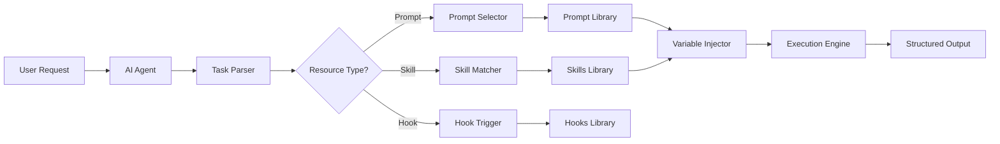

# AI Agent Integration Guide

Technical specifications for AI agents, assistants, and automation systems to programmatically access and utilize the Useful AI Prompts library.

## Library Overview

| Resource    | Count | Location            | Description                                 |
| ----------- | ----- | ------------------- | ------------------------------------------- |
| **Prompts** | 557+  | `/prompts/`         | Expert-crafted prompts across 47 categories |
| **Skills**  | 260+  | `/skills/`          | Claude Code auto-triggering capabilities    |
| **Hooks**   | 7     | `/hooks/`           | Event-driven automation scripts             |
| **Index**   | 1     | `PROMPT-INDEX.json` | Machine-readable prompt catalog             |

---

## Integration Architecture



---

## Prompt Selection

### Category Taxonomy

```yaml
# 47 categories organized by domain
categories:
  business:
    - business
    - finance
    - financial-planning
    - marketing
    - operations
    - project-management
    - human-resources
    - customer-service
    - administrative

  technical:
    - technical
    - technical-workflows
    - technical-templates
    - security
    - development

  creative:
    - creative
    - content-creation
    - communication

  research:
    - research
    - research-workflows
    - academic

  specialized:
    - healthcare
    - healthcare-digital
    - engineering
    - education

  emerging_tech:
    - quantum-computing
    - blockchain
    - biotechnology
    - space-economy
    - renewable-energy
    - government
    - supply-chain

  personal:
    - personal-growth
    - personal-productivity
    - career-development
    - health-wellness
    - relationships-communication
    - learning-skills
    - learning-development

  workflow:
    - analysis
    - planning
    - problem-solving
    - decision-making
    - evaluation-assessment
    - creativity-innovation
    - management-leadership
    - optimization
    - customer-focused
    - creation
```

### Selection Algorithm

```python
def select_prompt(user_request: str) -> str:
    """
    Select the most appropriate prompt based on user request analysis.
    """
    # Step 1: Extract key indicators
    indicators = extract_indicators(user_request)

    # Step 2: Match against prompt taxonomy
    category = match_category(indicators)
    subcategory = match_subcategory(indicators, category)

    # Step 3: Score specific prompts
    candidates = load_prompts(category, subcategory)
    scores = score_prompts(candidates, indicators)

    # Step 4: Return best match
    return select_best_match(scores)


def extract_indicators(request: str) -> dict:
    """Extract classification indicators from request."""
    return {
        'keywords': extract_keywords(request),
        'domain': detect_domain(request),
        'task_type': detect_task_type(request),
        'complexity': assess_complexity(request),
        'output_format': detect_output_format(request)
    }
```

### Task Classification Keywords

```yaml
technical:
  keywords:
    [
      code,
      develop,
      debug,
      deploy,
      architecture,
      security,
      data,
      api,
      database,
      test,
    ]
  subcategories:
    software-engineering: [build, implement, refactor, optimize, review]
    devops: [pipeline, deployment, CI/CD, infrastructure, container, kubernetes]
    security: [threat, vulnerability, compliance, audit, encryption]
    data-science:
      [model, analysis, prediction, validation, ml, machine learning]

business:
  keywords: [strategy, manage, analyze, plan, organize, lead, budget, forecast]
  subcategories:
    finance: [budget, forecast, valuation, investment, roi, financial]
    marketing: [campaign, brand, audience, conversion, content, seo]
    operations: [process, efficiency, workflow, optimization, supply chain]
    management: [team, project, resource, stakeholder, leadership]

emerging_tech:
  keywords: [quantum, blockchain, biotech, space, renewable, web3, defi]
  subcategories:
    quantum-computing: [qubit, circuit, algorithm, quantum ml, optimization]
    blockchain: [smart contract, defi, nft, tokenization, web3]
    biotechnology: [drug discovery, genomics, crispr, clinical trial]
    space-economy: [satellite, spacecraft, mission, orbital, launch]
    renewable-energy: [solar, wind, battery, grid, sustainability]

creative:
  keywords: [design, create, brand, user, experience, content, visual]
  subcategories:
    design: [visual, graphic, brand, identity, ui]
    ux-design: [user, research, interface, experience, usability]
    content: [write, editorial, strategy, messaging, copywriting]

specialized:
  keywords: [research, healthcare, education, engineering, pharmaceutical]
  subcategories:
    healthcare: [clinical, pharmaceutical, patient, treatment, medical]
    research: [study, analysis, hypothesis, methodology, academic]
    engineering: [build, construct, manufacture, technical, mechanical]
```

### Direct Task Mapping

```python
TASK_TO_PROMPT_MAP = {
    # Financial tasks
    "analyze financial performance": "financial-analysis-expert",
    "create financial projections": "financial-model-builder",
    "evaluate investment": "financial-analysis-expert",

    # Development tasks
    "build web application": "fullstack-developer-architect",
    "optimize code performance": "algorithm-optimization-expert",
    "design system architecture": "system-architecture-design-expert",

    # Security tasks
    "security assessment": "cybersecurity-defense-architect",
    "incident response": "incident-response-commander",
    "design secure architecture": "security-implementation-expert",

    # Business analysis
    "gather requirements": "requirements-engineering-expert",
    "process improvement": "process-optimization-expert",
    "create specifications": "specification-creation-expert",

    # Emerging tech
    "quantum algorithm": "quantum-circuit-optimization-design",
    "smart contract": "smart-contract-security-audit-platform",
    "drug discovery": "ai-powered-drug-screening-optimization",
    "satellite operations": "commercial-space-mission-architecture",
    "solar project": "utility-scale-solar-farm-development"
}
```

---

## Skills Integration

### What Are Skills?

Skills are specialized Claude Code capabilities that auto-trigger based on request keywords. Unlike prompts, skills:

- Activate automatically without explicit selection
- Provide step-by-step guidance with code examples
- Include multi-language implementations
- Range from 200-500+ lines of detailed instructions

### Skill Matching

```python
def match_skill(user_request: str) -> Optional[str]:
    """
    Match user request to appropriate skill based on keywords.
    """
    skills_index = load_skills_index()

    for skill in skills_index:
        if any(trigger in user_request.lower() for trigger in skill['triggers']):
            return skill['name']

    return None


# Example skill triggers
SKILL_TRIGGERS = {
    "refactor-legacy-code": ["refactor", "modernize", "legacy code", "technical debt"],
    "docker-containerization": ["docker", "containerize", "container", "dockerfile"],
    "unit-testing-framework": ["unit test", "test coverage", "testing framework"],
    "rest-api-design": ["api design", "rest api", "endpoint design"],
    "sql-optimization": ["sql optimization", "query performance", "slow query"],
    "kubernetes-deployment": ["kubernetes", "k8s", "deploy to cluster"],
    "security-audit": ["security audit", "vulnerability scan", "penetration test"]
}
```

### Skills by Domain

| Domain               | Count | Key Skills                                                    |
| -------------------- | ----- | ------------------------------------------------------------- |
| Software Development | 35    | refactor-legacy-code, code-review-analysis, design-patterns   |
| DevOps               | 20    | docker-containerization, kubernetes-deployment, terraform-iac |
| Testing              | 15    | unit-testing-framework, e2e-testing, test-automation          |
| Security             | 15    | vulnerability-scanning, oauth-implementation, data-encryption |
| API                  | 12    | rest-api-design, graphql-implementation, webhook-development  |
| Database             | 12    | sql-optimization, schema-design, database-indexing            |
| Cloud                | 15    | aws-lambda, serverless-architecture, cloud-cost-optimization  |
| Frontend             | 12    | react-components, responsive-design, css-architecture         |
| Backend              | 12    | nodejs-express, django-application, background-jobs           |
| ML/AI                | 10    | ml-model-training, model-deployment, hyperparameter-tuning    |

### Loading Skills

```python
import os
from pathlib import Path

def load_skill(skill_name: str) -> str:
    """Load skill content from skills directory."""
    skill_path = Path("skills") / f"{skill_name}.md"
    if skill_path.exists():
        return skill_path.read_text()
    raise FileNotFoundError(f"Skill not found: {skill_name}")


def list_skills() -> list:
    """List all available skills."""
    skills_dir = Path("skills")
    return [f.stem for f in skills_dir.glob("*.md")]
```

---

## Hooks Integration

### What Are Hooks?

Hooks are automation scripts that execute in response to Claude Code events:

| Hook                      | Trigger Event | Purpose                               |
| ------------------------- | ------------- | ------------------------------------- |
| security-scan             | Pre-commit    | Scan for vulnerabilities and secrets  |
| pre-commit-linting        | Pre-commit    | Code formatting and style enforcement |
| test-runner               | Pre-commit    | Run automated tests                   |
| dependency-check          | Pre-commit    | Audit dependencies                    |
| breaking-change-detection | Pre-commit    | Detect API breaking changes           |
| auto-format               | Post-save     | Automatic code formatting             |
| session-setup             | Session start | Environment initialization            |

### Hook Execution

```python
def execute_hook(hook_name: str, context: dict) -> dict:
    """
    Execute a hook with the given context.
    """
    hook_path = Path("hooks") / hook_name
    if not hook_path.exists():
        raise FileNotFoundError(f"Hook not found: {hook_name}")

    # Load hook configuration
    config = load_hook_config(hook_path)

    # Execute hook script
    result = run_hook_script(config, context)

    return {
        'status': result.returncode == 0,
        'output': result.stdout,
        'errors': result.stderr
    }
```

---

## Prompt Metadata Schema

```json
{
  "prompt_id": "financial-analysis-expert",
  "file_path": "prompts/finance/financial-analysis-expert.md",
  "category": "finance",
  "subcategory": "analysis",
  "title": "Financial Analysis Expert",
  "description": "Expert financial analysis with investment evaluation and portfolio management",
  "tags": ["finance", "investment", "analysis", "valuation", "portfolio"],
  "use_cases": [
    "company valuation",
    "investment decisions",
    "portfolio review",
    "market analysis"
  ],
  "complexity_level": "advanced",
  "estimated_output_lines": 600
}
```

---

## Variable Injection

### Standard Variables

```yaml
common_variables:
  - company_name: "Organization name"
  - industry: "Industry sector"
  - team_size: "Number of team members"
  - timeline: "Project timeline"
  - budget: "Available budget"
  - constraints: "Specific limitations"
  - goals: "Desired outcomes"

domain_specific:
  technical:
    - technology_stack: "Current tech stack"
    - architecture_type: "System architecture"
    - performance_requirements: "Performance targets"
    - security_requirements: "Security standards"
    - codebase_size: "Lines of code or repository size"

  business:
    - market_conditions: "Current market state"
    - competition: "Competitive landscape"
    - regulatory_environment: "Compliance requirements"
    - stakeholders: "Key stakeholders"
    - revenue_model: "Business revenue model"

  emerging_tech:
    - technology_readiness: "TRL level"
    - regulatory_status: "Regulatory approval status"
    - infrastructure_requirements: "Infrastructure needs"
```

### Variable Extraction

```python
def extract_variables(user_request: str, prompt_template: str) -> dict:
    """
    Extract values for prompt variables from user request.
    """
    variables = {}
    required_vars = extract_template_variables(prompt_template)

    for var in required_vars:
        value = (
            extract_explicit_value(user_request, var) or
            extract_implicit_value(user_request, var) or
            infer_from_context(user_request, var) or
            get_default_value(var)
        )
        variables[var] = value

    return variables


def extract_template_variables(template: str) -> list:
    """Extract variable names from template."""
    import re
    pattern = r'\{\{(\w+)\}\}'
    return re.findall(pattern, template)
```

---

## API Specification

### RESTful Endpoints

```yaml
endpoints:
  # Prompts
  GET /api/prompts:
    description: "List all available prompts"
    parameters:
      - category: "Filter by category"
      - tags: "Filter by tags (comma-separated)"
      - search: "Full-text search"
    response:
      - prompts: "Array of prompt metadata"
      - total: "Total count"

  GET /api/prompts/{prompt_id}:
    description: "Get specific prompt"
    response:
      - metadata: "Prompt metadata"
      - content: "Prompt content"
      - variables: "Required variables"

  POST /api/match:
    description: "Find best matching prompt"
    body:
      - request: "User request text"
      - context: "Additional context"
      - preferences: "User preferences"
    response:
      - prompt_id: "Best matching prompt"
      - confidence: "Match confidence score (0-1)"
      - alternatives: "Other potential matches"

  # Skills
  GET /api/skills:
    description: "List all available skills"
    parameters:
      - domain: "Filter by domain"
    response:
      - skills: "Array of skill metadata"

  GET /api/skills/{skill_name}:
    description: "Get specific skill"
    response:
      - metadata: "Skill metadata"
      - content: "Skill content"
      - triggers: "Trigger keywords"

  # Hooks
  GET /api/hooks:
    description: "List all available hooks"
    response:
      - hooks: "Array of hook metadata"

  POST /api/hooks/{hook_name}/execute:
    description: "Execute a hook"
    body:
      - context: "Execution context"
    response:
      - status: "Success/failure"
      - output: "Hook output"
```

---

## Execution Framework

### Four-Phase Processing

```python
class PromptExecutor:
    def execute(self, prompt: str, variables: dict) -> str:
        """
        Execute prompt through standard four-phase framework.
        """
        # Prepare prompt with variables
        prepared_prompt = self.inject_variables(prompt, variables)

        # Phase 1: Assessment/Analysis
        assessment = self.execute_phase("assessment", prepared_prompt)

        # Phase 2: Strategic Design
        strategy = self.execute_phase("strategy", assessment)

        # Phase 3: Implementation/Execution
        implementation = self.execute_phase("implementation", strategy)

        # Phase 4: Optimization/Control
        optimization = self.execute_phase("optimization", implementation)

        # Compile structured output
        return self.compile_output([
            assessment,
            strategy,
            implementation,
            optimization
        ])
```

### Output Structure

```yaml
output_structure:
  executive_summary:
    - key_findings: "Top 3-5 insights"
    - recommendations: "Primary actions"
    - impact_assessment: "Expected outcomes"

  detailed_analysis:
    - current_state: "Comprehensive assessment"
    - gap_analysis: "Identified gaps"
    - root_causes: "Underlying issues"

  strategic_plan:
    - objectives: "SMART goals"
    - strategies: "Approach for each objective"
    - tactics: "Specific actions"

  implementation_roadmap:
    - phases: "Breakdown by timeline"
    - milestones: "Key deliverables"
    - resources: "Required resources"

  risk_management:
    - risk_assessment: "Identified risks"
    - mitigation_strategies: "Risk responses"
    - contingency_plans: "Backup approaches"

  metrics_and_monitoring:
    - kpis: "Key performance indicators"
    - dashboards: "Monitoring approach"
    - review_cycles: "Evaluation schedule"
```

---

## Performance Optimization

### Caching Strategy

```python
from functools import lru_cache
from pathlib import Path

@lru_cache(maxsize=100)
def get_prompt_content(prompt_id: str) -> str:
    """Cache prompt content for repeated access."""
    prompt_path = find_prompt_path(prompt_id)
    return prompt_path.read_text()


@lru_cache(maxsize=50)
def get_skill_content(skill_name: str) -> str:
    """Cache skill content for repeated access."""
    skill_path = Path("skills") / f"{skill_name}.md"
    return skill_path.read_text()


def clear_caches():
    """Clear all caches when content updates."""
    get_prompt_content.cache_clear()
    get_skill_content.cache_clear()
```

### Batch Processing

```python
from concurrent.futures import ThreadPoolExecutor

def batch_process_requests(requests: list[dict]) -> list[dict]:
    """Process multiple requests efficiently."""
    # Group by resource type
    prompts_requests = [r for r in requests if r['type'] == 'prompt']
    skills_requests = [r for r in requests if r['type'] == 'skill']

    results = []

    # Process in parallel
    with ThreadPoolExecutor(max_workers=4) as executor:
        prompt_futures = [
            executor.submit(process_prompt_request, r)
            for r in prompts_requests
        ]
        skill_futures = [
            executor.submit(process_skill_request, r)
            for r in skills_requests
        ]

        results.extend([f.result() for f in prompt_futures])
        results.extend([f.result() for f in skill_futures])

    return results
```

---

## Error Handling

```python
class PromptLibraryError(Exception):
    """Base exception for prompt library errors."""
    pass

class PromptNotFoundError(PromptLibraryError):
    """Requested prompt does not exist."""
    pass

class SkillNotFoundError(PromptLibraryError):
    """Requested skill does not exist."""
    pass

class VariableExtractionError(PromptLibraryError):
    """Failed to extract required variables."""
    pass

def handle_error(error: Exception) -> dict:
    """Graceful error handling with fallbacks."""
    if isinstance(error, PromptNotFoundError):
        return {
            'status': 'error',
            'message': f'Prompt not found: {error}',
            'suggestion': 'Try browsing available prompts at /api/prompts',
            'fallback': get_general_purpose_prompt()
        }
    elif isinstance(error, SkillNotFoundError):
        return {
            'status': 'error',
            'message': f'Skill not found: {error}',
            'suggestion': 'Try browsing available skills at /api/skills'
        }
    elif isinstance(error, VariableExtractionError):
        return {
            'status': 'partial',
            'message': 'Some variables could not be extracted',
            'missing_variables': error.missing_vars,
            'partial_result': execute_with_defaults(error.prompt)
        }
    else:
        return {
            'status': 'error',
            'message': str(error)
        }
```

---

## Testing

### Prompt Validation

```python
def validate_prompt(prompt_path: str) -> bool:
    """Validate prompt meets quality standards."""
    prompt = load_prompt(prompt_path)

    # Check structure
    assert has_metadata_section(prompt), "Missing metadata"
    assert has_use_cases(prompt), "Missing use cases"
    assert has_deliverables(prompt), "Missing deliverables"

    # Check content quality
    assert len(prompt) > 500, "Prompt too short"
    assert has_context_questions(prompt), "Missing context questions"

    return True


def validate_skill(skill_path: str) -> bool:
    """Validate skill meets quality standards."""
    skill = load_skill(skill_path)

    # Check structure
    assert has_triggers(skill), "Missing trigger keywords"
    assert has_code_examples(skill), "Missing code examples"
    assert has_best_practices(skill), "Missing best practices"

    # Check content
    assert len(skill) > 200, "Skill too short"

    return True
```

---

## Integration Examples

### Python Integration

```python
import requests

class PromptLibraryClient:
    def __init__(self, base_url: str = "https://api.example.com"):
        self.base_url = base_url

    def find_prompt(self, user_request: str) -> dict:
        """Find best matching prompt for request."""
        response = requests.post(
            f"{self.base_url}/api/match",
            json={"request": user_request}
        )
        return response.json()

    def get_prompt(self, prompt_id: str) -> dict:
        """Get prompt content and metadata."""
        response = requests.get(
            f"{self.base_url}/api/prompts/{prompt_id}"
        )
        return response.json()

    def list_skills(self, domain: str = None) -> list:
        """List available skills."""
        params = {"domain": domain} if domain else {}
        response = requests.get(
            f"{self.base_url}/api/skills",
            params=params
        )
        return response.json()["skills"]


# Usage
client = PromptLibraryClient()
match = client.find_prompt("Help me analyze financial performance")
prompt = client.get_prompt(match["prompt_id"])
```

### JavaScript/TypeScript Integration

```typescript
interface PromptMatch {
  prompt_id: string;
  confidence: number;
  alternatives: string[];
}

interface Prompt {
  metadata: Record<string, unknown>;
  content: string;
  variables: string[];
}

class PromptLibrary {
  constructor(private baseUrl: string = "https://api.example.com") {}

  async findPrompt(request: string): Promise<PromptMatch> {
    const response = await fetch(`${this.baseUrl}/api/match`, {
      method: "POST",
      headers: { "Content-Type": "application/json" },
      body: JSON.stringify({ request }),
    });
    return response.json();
  }

  async getPrompt(promptId: string): Promise<Prompt> {
    const response = await fetch(`${this.baseUrl}/api/prompts/${promptId}`);
    return response.json();
  }

  async listSkills(domain?: string): Promise<string[]> {
    const params = domain ? `?domain=${domain}` : "";
    const response = await fetch(`${this.baseUrl}/api/skills${params}`);
    const data = await response.json();
    return data.skills;
  }
}
```

---

## File Access Patterns

### Direct File Access

```python
from pathlib import Path
import json

# Load prompt index
def load_prompt_index() -> list:
    with open("PROMPT-INDEX.json") as f:
        return json.load(f)

# Find prompt file
def find_prompt_file(prompt_id: str) -> Path:
    prompts_dir = Path("prompts")
    for md_file in prompts_dir.rglob("*.md"):
        if md_file.stem == prompt_id:
            return md_file
    raise FileNotFoundError(f"Prompt not found: {prompt_id}")

# List all skills
def list_all_skills() -> list:
    skills_dir = Path("skills")
    return sorted([f.stem for f in skills_dir.glob("*.md")])

# List all hooks
def list_all_hooks() -> list:
    hooks_dir = Path("hooks")
    return [d.name for d in hooks_dir.iterdir()
            if d.is_dir() and not d.name.startswith('.')]
```

---

## Support

- **Documentation**: [README.md](README.md)
- **Human Guide**: [README-HUMANS.md](README-HUMANS.md)
- **Skills Reference**: [SKILLS-MATRIX.md](SKILLS-MATRIX.md)
- **Hooks Reference**: [HOOKS-LIBRARY.md](HOOKS-LIBRARY.md)
- **Issues**: [GitHub Issues](https://github.com/aj-geddes/useful-ai-prompts/issues)
