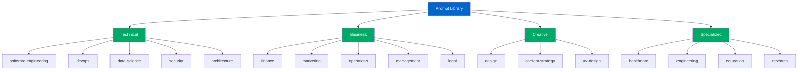
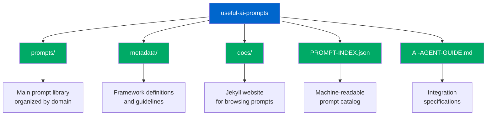

# AI Assistant Prompt Library

## 486+ Expert-Level Prompts for AI Assistants and Agents

This repository contains **486 specialized prompts** across **22 categories** designed for AI assistants to adopt expert personas when completing tasks. Each prompt combines multiple expert perspectives with professional frameworks to deliver optimal results.

### 🚀 **Massive 2025 Expansion**

The library has grown from 259 to **486+ prompts**, adding comprehensive coverage for high-growth sectors:

- **Biotechnology** (15 prompts): Drug discovery, bioinformatics, gene editing, clinical trials
- **Blockchain** (5 prompts): DeFi, smart contracts, tokenization, Web3 development
- **Government Digital** (8 prompts): Digital transformation, smart cities, citizen services, policy
- **Healthcare Digital** (20 prompts): Telehealth, AI clinical decision support, patient engagement, EHR
- **Quantum Computing** (14 prompts): Algorithm development, quantum circuits, quantum ML, optimization
- **Renewable Energy** (19 prompts): Solar development, energy storage, grid integration, sustainability
- **Space Economy** (24 prompts): Commercial spaceflight, satellite operations, space tech, mission planning
- **Supply Chain** (6 prompts): Resilience planning, digital transformation, logistics optimization

### Quick Selection Guide

When assigned a task, select the appropriate prompt based on:

1. **Task Type** → Find matching workflow category
2. **Domain** → Select relevant expertise area
3. **Complexity** → Choose appropriate depth level

### Prompt Selection Matrix

| Task Category                | Primary Location                           | Key Prompts                                                                                       |
| ---------------------------- | ------------------------------------------ | ------------------------------------------------------------------------------------------------- |
| **Financial Analysis**       | `/prompts/finance/`                        | `financial-analysis-expert.md` - Investment analysis, valuation, portfolio management             |
| **Software Development**     | `/prompts/technical/software-engineering/` | `fullstack-developer-architect.md` - Full-stack development with system architecture              |
| **Security Operations**      | `/prompts/technical/security/`             | `cybersecurity-defense-architect.md` - Threat detection, incident response, security architecture |
| **Business Analysis**        | `/prompts/business/business-analysis/`     | `business-analyst-strategic-excellence.md` - Requirements engineering, process improvement        |
| **Project Management**       | `/prompts/business/project-management/`    | `comprehensive-risk-assessment.md` - Risk analysis and mitigation planning                        |
| **Marketing Strategy**       | `/prompts/business/marketing/`             | `marketing-manager-strategist.md` - Team leadership, campaign management                          |
| **HR Management**            | `/prompts/human-resources/`                | `hr-excellence-leader.md` - Talent strategy, organizational development                           |
| **Customer Service**         | `/prompts/customer-service/`               | `customer-experience-excellence-leader.md` - Service operations, team leadership                  |
| **Data Science**             | `/prompts/technical/data-science/`         | `model-evaluation-framework.md` - ML model validation and deployment                              |
| **Research**                 | `/prompts/academic/research/`              | `research-excellence-scientist.md` - Scientific research and grant writing                        |
| **Executive Support**        | `/prompts/administrative/`                 | `executive-excellence-partner.md` - Strategic administrative support                              |
| **Supply Chain**             | `/prompts/operations/`                     | `supply-chain-excellence-director.md` - Logistics and network optimization                        |
| **Construction**             | `/prompts/engineering/`                    | `construction-excellence-director.md` - Project delivery and safety management                    |
| **Pharmaceutical R&D**       | `/prompts/healthcare/`                     | `pharmaceutical-research-excellence.md` - Drug development and clinical trials                    |
| **Graphic Design**           | `/prompts/creative/design/`                | `graphic-design-expert.md` - Visual design and brand strategy                                     |
| **Compliance**               | `/prompts/business/legal/`                 | `compliance-officer-expert.md` - Regulatory compliance and risk management                        |
| **Operations**               | `/prompts/business/operations/`            | `operations-manager-excellence.md` - Operational excellence and team development                  |
| **🧬 Biotechnology**          | `/prompts/biotechnology/`                  | `ai-powered-drug-screening-optimization.md` - Drug discovery and bioinformatics analysis         |
| **🔗 Blockchain & Web3**      | `/prompts/blockchain/`                     | `decentralized-finance-protocol-development.md` - DeFi protocols and smart contracts             |
| **🏛️ Government Digital**     | `/prompts/government/`                     | `digital-government-transformation-strategy.md` - Public sector digital transformation           |
| **🏥 Healthcare Digital**     | `/prompts/healthcare-digital/`             | `healthcare-digital-transformation-strategist.md` - Healthcare technology and telehealth         |
| **⚛️ Quantum Computing**      | `/prompts/quantum-computing/`              | `quantum-circuit-optimization-design.md` - Quantum algorithms and circuit development            |
| **☀️ Renewable Energy**       | `/prompts/renewable-energy/`               | `utility-scale-solar-farm-development.md` - Solar development and clean energy projects          |
| **🚀 Space Economy**          | `/prompts/space-economy/`                  | `commercial-space-mission-architecture.md` - Commercial spaceflight and satellite operations     |
| **📦 Supply Chain Digital**   | `/prompts/supply-chain/`                   | `supply-chain-resilience-strategy-architect.md` - Digital supply chain transformation            |

### How to Use Prompts

1. **Load the appropriate prompt file**
2. **Replace all `{{variables}}` with context-specific information**
3. **Execute the four-phase framework**:
   - Phase 1: Assessment/Analysis
   - Phase 2: Strategic Design
   - Phase 3: Implementation/Execution
   - Phase 4: Optimization/Control

### Prompt Structure

Each prompt contains:

```yaml
Metadata:
  - Category: Domain classification
  - Tags: Searchable keywords
  - Personas: Expert roles to adopt
  - Use Cases: Applicable scenarios

Architecture:
  - Dual-Persona: Primary expert + complementary specialist
  - Frameworks: 3-5 professional methodologies
  - Processing: 4-phase systematic approach
  - Output: Structured deliverables (600+ lines average)
```

### Task Matching Examples

**User Request**: "Help me analyze our company's financial performance and create projections"
→ **Select**: `/prompts/finance/financial-analysis-expert.md`

**User Request**: "Design a secure architecture for our cloud migration"
→ **Select**: `/prompts/technical/security/cybersecurity-defense-architect.md`

**User Request**: "Create a comprehensive hiring process for engineering roles"
→ **Select**: `/prompts/human-resources/hr-excellence-leader.md`

**User Request**: "Optimize our software deployment pipeline"
→ **Select**: `/prompts/technical/devops/cicd-pipeline-optimizer.md`

### Integration Guidelines

For AI agents and assistants:

1. **Parse task requirements** to identify:
   - Primary domain (technical, business, creative, etc.)
   - Specific workflow (analysis, creation, optimization, etc.)
   - Output requirements (reports, code, strategies, etc.)

2. **Match to prompt taxonomy**:

   ```mermaid
   flowchart LR
       A[Task] --> B{Domain?}
       B -->|Technical| C[prompts/technical/]
       B -->|Business| D[prompts/business/]
       B -->|Creative| E[prompts/creative/]
       B -->|Specialized| F[prompts/specialized/]

       C --> C1[subcategory/]
       D --> D1[subcategory/]
       E --> E1[subcategory/]
       F --> F1[subcategory/]

       C1 --> G[specific-prompt.md]
       D1 --> G
       E1 --> G
       F1 --> G

       style A fill:#0066cc,color:#fff
       style G fill:#00aa66,color:#fff
   ```

3. **Load and customize** the selected prompt:
   - Inject task-specific context
   - Set appropriate variables
   - Adjust output format if needed

4. **Execute systematically**:
   - Follow the 4-phase framework
   - Maintain persona consistency
   - Deliver structured outputs

### Metadata Index

Quick reference for programmatic selection:



**JSON Format** (for programmatic access):
```json
{
  "prompts": {
    "technical": [
      "software-engineering",
      "devops",
      "data-science",
      "security",
      "architecture"
    ],
    "business": ["finance", "marketing", "operations", "management", "legal"],
    "creative": ["design", "content-strategy", "ux-design"],
    "specialized": ["healthcare", "engineering", "education", "research"]
  }
}
```

### Performance Notes

- Each prompt is designed for 600+ line outputs
- Combines multiple expert perspectives
- Includes industry-standard frameworks
- Optimized for accuracy and completeness

### Repository Structure



---

**For human users**: See [README-HUMANS.md](README-HUMANS.md) for user-friendly documentation and examples.

**For developers**: See [AI-AGENT-GUIDE.md](AI-AGENT-GUIDE.md) for integration specifications.
