# Claude Code Skills Matrix

## Overview

This matrix contains **200 specialized skills** organized into **20 categories** to help Claude Code efficiently handle specific technical tasks. Each skill is designed following [Claude Code Skills best practices](https://code.claude.com/docs/en/skills) with focused scope, specific descriptions, and actionable instructions.

## Skills Organization

Skills are located in `.claude/skills/` and follow the standard format:
- Each skill has its own directory
- Contains `SKILL.md` with YAML frontmatter
- Includes instructions, examples, and supporting documentation

## Quick Navigation

```mermaid
graph TB
    A[Skills Library<br/>200 Skills] --> B[Development<br/>35 skills]
    A --> C[Data & Analytics<br/>20 skills]
    A --> D[DevOps & Infrastructure<br/>20 skills]
    A --> E[Security & Compliance<br/>15 skills]
    A --> F[Testing & QA<br/>15 skills]
    A --> G[Documentation<br/>15 skills]
    A --> H[Database & Storage<br/>12 skills]
    A --> I[API & Integration<br/>12 skills]
    A --> J[Cloud Platforms<br/>15 skills]
    A --> K[Frontend Dev<br/>12 skills]
    A --> L[Backend Dev<br/>12 skills]
    A --> M[Mobile Dev<br/>8 skills]
    A --> N[ML & AI<br/>10 skills]
    A --> O[Monitoring<br/>8 skills]
    A --> P[Version Control<br/>10 skills]
    A --> Q[Project Mgmt<br/>10 skills]
    A --> R[Business Analysis<br/>8 skills]
    A --> S[Design & UX<br/>8 skills]
    A --> T[Performance<br/>8 skills]
    A --> U[Troubleshooting<br/>12 skills]

    style A fill:#0066cc,color:#fff
    style B fill:#00aa66,color:#fff
    style C fill:#00aa66,color:#fff
    style D fill:#00aa66,color:#fff
    style E fill:#00aa66,color:#fff
    style F fill:#00aa66,color:#fff
    style G fill:#00aa66,color:#fff
    style H fill:#00aa66,color:#fff
    style I fill:#00aa66,color:#fff
    style J fill:#00aa66,color:#fff
    style K fill:#00aa66,color:#fff
    style L fill:#00aa66,color:#fff
    style M fill:#00aa66,color:#fff
    style N fill:#00aa66,color:#fff
    style O fill:#00aa66,color:#fff
    style P fill:#00aa66,color:#fff
    style Q fill:#00aa66,color:#fff
    style R fill:#00aa66,color:#fff
    style S fill:#00aa66,color:#fff
    style T fill:#00aa66,color:#fff
    style U fill:#00aa66,color:#fff
```

---

## 1. Software Development & Engineering (35 skills)

| Skill Name | Description | Trigger Keywords |
|------------|-------------|------------------|
| `refactor-legacy-code` | Modernize and improve legacy codebases while maintaining functionality | refactor, legacy, modernize, technical debt |
| `code-review-analysis` | Perform comprehensive code reviews with best practices and security checks | code review, review PR, analyze code quality |
| `design-patterns-implementation` | Apply appropriate design patterns to solve architectural problems | design pattern, singleton, factory, observer |
| `dependency-management` | Manage project dependencies, versions, and resolve conflicts | dependencies, npm install, package version |
| `microservices-architecture` | Design and implement microservices-based systems | microservices, service mesh, distributed system |
| `api-versioning-strategy` | Implement API versioning and backward compatibility | API version, backward compatible, deprecate endpoint |
| `error-handling-framework` | Build robust error handling and recovery mechanisms | error handling, exception, try-catch, error recovery |
| `logging-best-practices` | Implement structured logging with appropriate levels and context | logging, log levels, structured logs, observability |
| `configuration-management` | Manage application configuration across environments | config, environment variables, settings management |
| `code-generation-template` | Generate boilerplate code and scaffolding for common patterns | generate code, scaffold, boilerplate, template |
| `cross-platform-compatibility` | Ensure code works across different operating systems and platforms | cross-platform, platform-specific, OS compatibility |
| `internationalization-i18n` | Implement multi-language support and localization | i18n, localization, translate, multi-language |
| `accessibility-compliance` | Ensure applications meet WCAG and accessibility standards | accessibility, WCAG, screen reader, a11y |
| `real-time-features` | Implement real-time updates using WebSockets or SSE | real-time, WebSocket, SSE, live updates |
| `caching-strategy` | Design and implement multi-layer caching solutions | cache, Redis, CDN, cache invalidation |
| `rate-limiting-implementation` | Implement rate limiting and throttling for APIs | rate limit, throttle, API quota, backpressure |
| `webhook-integration` | Design and implement webhook systems for event-driven architecture | webhook, event-driven, callback, event notification |
| `batch-processing-jobs` | Create efficient batch processing and background job systems | batch job, background task, queue, job scheduler |
| `data-migration-scripts` | Write safe and reversible data migration scripts | data migration, database migration, schema change |
| `feature-flag-system` | Implement feature flags for gradual rollouts and A/B testing | feature flag, feature toggle, A/B test, canary |
| `graceful-shutdown` | Implement graceful shutdown handling for services | graceful shutdown, SIGTERM, drain connections |
| `health-check-endpoints` | Create comprehensive health check and readiness endpoints | health check, liveness, readiness, monitoring |
| `circuit-breaker-pattern` | Implement circuit breakers for resilient service communication | circuit breaker, fault tolerance, retry logic |
| `event-sourcing` | Implement event sourcing and CQRS patterns | event sourcing, CQRS, event store, aggregate |
| `idempotency-handling` | Ensure operations are idempotent for reliability | idempotent, duplicate request, retry safety |
| `correlation-tracing` | Implement request correlation and distributed tracing | trace ID, correlation, distributed tracing, span |
| `api-documentation-generation` | Generate and maintain API documentation automatically | API docs, OpenAPI, Swagger, documentation |
| `code-metrics-analysis` | Analyze code complexity, coverage, and quality metrics | code metrics, complexity, cyclomatic, maintainability |
| `static-code-analysis` | Perform static analysis to detect bugs and code smells | static analysis, linter, code smell, SonarQube |
| `profiling-optimization` | Profile code performance and identify optimization opportunities | profiling, performance, bottleneck, flame graph |
| `memory-leak-detection` | Detect and fix memory leaks in applications | memory leak, heap dump, memory profiling |
| `concurrency-patterns` | Implement thread-safe concurrent programming patterns | concurrency, thread-safe, mutex, semaphore, async |
| `reactive-programming` | Implement reactive streams and event-driven architectures | reactive, RxJS, streams, backpressure |
| `polyglot-integration` | Integrate multiple programming languages in one system | polyglot, FFI, language interop, native bindings |
| `technical-debt-assessment` | Assess and prioritize technical debt remediation | technical debt, code quality, refactoring priority |

---

## 2. Data Science & Analytics (20 skills)

| Skill Name | Description | Trigger Keywords |
|------------|-------------|------------------|
| `exploratory-data-analysis` | Perform EDA to understand datasets and identify patterns | EDA, data exploration, statistics, data profiling |
| `data-cleaning-pipeline` | Clean and preprocess messy data for analysis | data cleaning, missing values, outliers, normalization |
| `statistical-hypothesis-testing` | Perform statistical tests to validate hypotheses | hypothesis test, t-test, chi-square, p-value, ANOVA |
| `time-series-analysis` | Analyze temporal data and forecast future trends | time series, forecasting, ARIMA, seasonality |
| `correlation-analysis` | Identify relationships and correlations between variables | correlation, Pearson, Spearman, scatter plot |
| `regression-modeling` | Build and evaluate regression models for prediction | regression, linear regression, polynomial, R-squared |
| `classification-modeling` | Create classification models for categorical predictions | classification, logistic regression, decision tree |
| `clustering-analysis` | Perform unsupervised clustering and segmentation | clustering, k-means, hierarchical, DBSCAN |
| `dimensionality-reduction` | Reduce feature space using PCA, t-SNE, or UMAP | PCA, t-SNE, UMAP, dimensionality reduction |
| `feature-engineering` | Create and select features to improve model performance | feature engineering, feature selection, transformation |
| `data-visualization` | Create insightful visualizations to communicate findings | visualization, chart, plot, dashboard, matplotlib |
| `ab-test-analysis` | Design and analyze A/B tests for statistical significance | A/B test, experiment, significance, conversion rate |
| `cohort-analysis` | Analyze user cohorts and retention patterns | cohort analysis, retention, user segments |
| `funnel-analysis` | Analyze conversion funnels and identify drop-off points | funnel, conversion, drop-off, user journey |
| `sentiment-analysis` | Analyze sentiment in text data using NLP techniques | sentiment analysis, NLP, text mining, opinion |
| `anomaly-detection` | Detect anomalies and outliers in datasets | anomaly detection, outlier, fraud detection |
| `recommendation-system` | Build collaborative or content-based recommendation engines | recommendation, collaborative filtering, personalization |
| `network-analysis` | Analyze graph and network data structures | network analysis, graph, centrality, community |
| `survival-analysis` | Perform survival and churn analysis | survival analysis, churn, hazard rate, Kaplan-Meier |
| `causal-inference` | Analyze causal relationships using statistical methods | causal inference, propensity score, counterfactual |

---

## 3. DevOps & Infrastructure (20 skills)

| Skill Name | Description | Trigger Keywords |
|------------|-------------|------------------|
| `docker-containerization` | Create optimized Docker containers and multi-stage builds | Docker, container, Dockerfile, image optimization |
| `kubernetes-deployment` | Deploy and manage applications on Kubernetes clusters | Kubernetes, k8s, pods, deployment, service |
| `terraform-infrastructure` | Manage infrastructure as code using Terraform | Terraform, IaC, infrastructure as code, tfstate |
| `ansible-automation` | Automate configuration management with Ansible | Ansible, playbook, configuration management |
| `cicd-pipeline-setup` | Set up CI/CD pipelines for automated deployment | CI/CD, pipeline, Jenkins, GitHub Actions, GitLab CI |
| `nginx-configuration` | Configure NGINX for reverse proxy, load balancing, SSL | NGINX, reverse proxy, load balancer, SSL |
| `load-balancer-setup` | Configure load balancing and traffic distribution | load balancer, HAProxy, traffic distribution |
| `service-mesh-implementation` | Implement service mesh for microservices communication | service mesh, Istio, Linkerd, mTLS |
| `infrastructure-monitoring` | Set up infrastructure monitoring and alerting | monitoring, Prometheus, Grafana, Datadog, alerts |
| `log-aggregation` | Aggregate and analyze logs from distributed systems | log aggregation, ELK, Splunk, Loki, centralized logs |
| `backup-disaster-recovery` | Implement backup strategies and disaster recovery plans | backup, disaster recovery, RTO, RPO, restore |
| `secrets-management` | Securely manage secrets and credentials | secrets, Vault, credentials, API keys, encryption |
| `blue-green-deployment` | Implement blue-green deployment strategies | blue-green, deployment strategy, zero-downtime |
| `canary-deployment` | Set up canary deployments for gradual rollouts | canary deployment, progressive delivery, traffic split |
| `autoscaling-configuration` | Configure horizontal and vertical autoscaling | autoscaling, HPA, VPA, scale up, scale down |
| `network-security-groups` | Configure network security and firewall rules | security groups, firewall, network ACL, ingress |
| `dns-management` | Manage DNS records and routing policies | DNS, Route53, domain, CNAME, A record |
| `ssl-certificate-management` | Manage SSL/TLS certificates and renewal automation | SSL, TLS, certificate, Let's Encrypt, HTTPS |
| `infrastructure-cost-optimization` | Optimize cloud infrastructure costs and resource usage | cost optimization, reserved instances, spot instances |
| `disaster-recovery-testing` | Test disaster recovery procedures and failover | DR testing, failover, recovery drill, chaos engineering |

---

## 4. Security & Compliance (15 skills)

| Skill Name | Description | Trigger Keywords |
|------------|-------------|------------------|
| `vulnerability-scanning` | Scan applications and infrastructure for vulnerabilities | vulnerability scan, CVE, security audit, OWASP |
| `penetration-testing` | Perform ethical hacking and penetration testing | pentest, penetration test, security testing, exploit |
| `oauth-implementation` | Implement OAuth 2.0 and OpenID Connect authentication | OAuth, authentication, SSO, OIDC, JWT |
| `api-security-hardening` | Secure APIs against common attacks and vulnerabilities | API security, rate limiting, authentication, CORS |
| `data-encryption` | Implement encryption at rest and in transit | encryption, AES, TLS, data security, cryptography |
| `security-compliance-audit` | Audit systems for compliance with security standards | compliance, SOC 2, GDPR, HIPAA, audit |
| `incident-response-plan` | Create and execute security incident response plans | incident response, breach, security incident, forensics |
| `access-control-rbac` | Implement role-based access control systems | RBAC, access control, permissions, authorization |
| `security-headers-configuration` | Configure security headers for web applications | security headers, CSP, HSTS, XSS protection |
| `sql-injection-prevention` | Prevent SQL injection attacks with parameterized queries | SQL injection, prepared statement, parameterized query |
| `xss-prevention` | Prevent cross-site scripting attacks | XSS, cross-site scripting, input sanitization |
| `csrf-protection` | Implement CSRF token protection | CSRF, cross-site request forgery, token validation |
| `security-audit-logging` | Implement comprehensive security audit logging | audit log, security log, compliance logging, SIEM |
| `secrets-rotation` | Automate credential rotation and secret management | secret rotation, credential rotation, key management |
| `zero-trust-architecture` | Implement zero-trust security architecture | zero trust, microsegmentation, least privilege |

---

## 5. Testing & Quality Assurance (15 skills)

| Skill Name | Description | Trigger Keywords |
|------------|-------------|------------------|
| `unit-testing-framework` | Write comprehensive unit tests with high coverage | unit test, Jest, pytest, JUnit, test coverage |
| `integration-testing` | Create integration tests for multi-component systems | integration test, API test, end-to-end component |
| `e2e-testing-automation` | Implement end-to-end testing with browser automation | E2E test, Selenium, Cypress, Playwright, automation |
| `test-data-generation` | Generate realistic test data and fixtures | test data, fixtures, mock data, faker |
| `mocking-stubbing` | Create mocks and stubs for isolated testing | mock, stub, spy, test double, Mockito |
| `property-based-testing` | Implement property-based testing for edge cases | property-based, QuickCheck, hypothesis testing |
| `mutation-testing` | Assess test effectiveness with mutation testing | mutation testing, test quality, mutant, Stryker |
| `performance-testing` | Test application performance under load | performance test, load test, JMeter, k6, benchmark |
| `stress-testing` | Perform stress testing to find breaking points | stress test, capacity, breaking point, spike test |
| `visual-regression-testing` | Detect visual changes and regressions | visual regression, screenshot diff, Percy |
| `api-contract-testing` | Implement contract testing for API compatibility | contract testing, Pact, API contract, schema validation |
| `accessibility-testing` | Test applications for accessibility compliance | accessibility test, axe, ARIA, keyboard navigation |
| `security-testing` | Perform security testing and vulnerability assessment | security test, SAST, DAST, penetration testing |
| `test-automation-framework` | Build maintainable test automation frameworks | test framework, page object, test architecture |
| `continuous-testing` | Integrate testing into CI/CD pipelines | continuous testing, CI testing, automated testing |

---

## 6. Documentation & Technical Writing (15 skills)

| Skill Name | Description | Trigger Keywords |
|------------|-------------|------------------|
| `api-reference-documentation` | Create comprehensive API reference documentation | API docs, REST API, endpoint documentation, OpenAPI |
| `architecture-diagrams` | Create system architecture and design diagrams | architecture diagram, C4, system design, flowchart |
| `user-guide-creation` | Write clear user guides and tutorials | user guide, tutorial, how-to, documentation |
| `developer-onboarding` | Create developer onboarding documentation | onboarding, getting started, setup guide, README |
| `changelog-maintenance` | Maintain changelogs following semantic versioning | changelog, release notes, version history |
| `runbook-creation` | Write operational runbooks for common procedures | runbook, playbook, operational procedures, SOP |
| `troubleshooting-guide` | Create troubleshooting guides for common issues | troubleshooting, FAQ, known issues, debug guide |
| `code-documentation` | Document code with clear comments and docstrings | code comments, docstring, JSDoc, inline documentation |
| `technical-specification` | Write detailed technical specifications | technical spec, requirements, design document |
| `api-changelog-versioning` | Document API changes and version migration guides | API changelog, breaking changes, migration guide |
| `database-schema-documentation` | Document database schemas and relationships | database schema, ERD, table documentation |
| `security-documentation` | Create security policies and best practices guides | security policy, security guidelines, compliance docs |
| `deployment-documentation` | Document deployment procedures and configurations | deployment guide, infrastructure docs, configuration |
| `markdown-documentation` | Create well-structured markdown documentation | markdown, README, documentation, formatting |
| `documentation-site-setup` | Set up documentation sites with search and navigation | docs site, Docusaurus, MkDocs, static site |

---

## 7. Database & Storage (12 skills)

| Skill Name | Description | Trigger Keywords |
|------------|-------------|------------------|
| `sql-query-optimization` | Optimize slow SQL queries for better performance | SQL optimization, query performance, index, explain |
| `database-indexing-strategy` | Design effective database indexing strategies | database index, composite index, query optimization |
| `database-schema-design` | Design normalized and efficient database schemas | schema design, normalization, ERD, relationships |
| `nosql-database-design` | Design NoSQL database schemas for scalability | NoSQL, MongoDB, DynamoDB, document database |
| `database-migration-management` | Manage database schema migrations safely | database migration, Flyway, Liquibase, schema change |
| `data-replication-setup` | Set up database replication for high availability | replication, master-slave, read replica, high availability |
| `database-sharding` | Implement database sharding for horizontal scaling | sharding, partitioning, horizontal scaling, distributed DB |
| `query-caching-strategies` | Implement effective query caching strategies | query cache, Redis, Memcached, cache hit rate |
| `database-backup-restore` | Implement database backup and restore procedures | database backup, mysqldump, pg_dump, point-in-time recovery |
| `transaction-management` | Implement ACID transactions and isolation levels | transaction, ACID, isolation level, commit, rollback |
| `stored-procedures` | Create and optimize database stored procedures | stored procedure, trigger, database function |
| `database-monitoring` | Monitor database performance and health metrics | database monitoring, slow queries, connection pool |

---

## 8. API & Integration (12 skills)

| Skill Name | Description | Trigger Keywords |
|------------|-------------|------------------|
| `rest-api-design` | Design RESTful APIs following best practices | REST API, RESTful, resource design, HTTP methods |
| `graphql-implementation` | Implement GraphQL APIs with resolvers and schema | GraphQL, schema, resolver, query, mutation |
| `grpc-service-development` | Build high-performance gRPC services | gRPC, protocol buffers, RPC, microservices |
| `api-authentication` | Implement secure API authentication mechanisms | API auth, JWT, OAuth, API key, bearer token |
| `api-rate-limiting` | Implement API rate limiting and quota management | rate limit, API quota, throttling, backpressure |
| `api-gateway-configuration` | Configure API gateways for routing and management | API gateway, Kong, AWS API Gateway, routing |
| `webhook-development` | Develop webhook systems for event notifications | webhook, callback, event-driven, HTTP callback |
| `third-party-integration` | Integrate with third-party APIs and services | third-party API, integration, SDK, API client |
| `api-error-handling` | Implement consistent API error handling | API error, error response, status code, error format |
| `api-pagination` | Implement efficient pagination for large datasets | pagination, cursor, offset, limit, page tokens |
| `api-filtering-sorting` | Implement flexible filtering and sorting for APIs | API filter, query parameters, sorting, search |
| `websocket-implementation` | Implement WebSocket connections for real-time data | WebSocket, real-time, bidirectional, socket.io |

---

## 9. Cloud Platforms (15 skills)

| Skill Name | Description | Trigger Keywords |
|------------|-------------|------------------|
| `aws-lambda-functions` | Build and deploy serverless functions on AWS Lambda | Lambda, serverless, AWS function, event-driven |
| `aws-s3-management` | Manage AWS S3 buckets and object storage | S3, object storage, bucket, AWS storage |
| `aws-ec2-setup` | Configure and manage AWS EC2 instances | EC2, instance, VM, AWS compute |
| `aws-rds-database` | Set up and manage AWS RDS databases | RDS, managed database, Aurora, PostgreSQL, MySQL |
| `aws-cloudfront-cdn` | Configure CloudFront CDN for content delivery | CloudFront, CDN, edge caching, distribution |
| `azure-functions` | Build serverless applications on Azure Functions | Azure Functions, serverless, Azure, function app |
| `azure-app-service` | Deploy web applications to Azure App Service | App Service, Azure web app, deployment |
| `gcp-cloud-functions` | Create Google Cloud Functions for event-driven tasks | Cloud Functions, GCP, serverless, Google Cloud |
| `gcp-cloud-run` | Deploy containerized apps on Google Cloud Run | Cloud Run, GCP, container, serverless container |
| `cloud-storage-optimization` | Optimize cloud storage costs and access patterns | storage optimization, lifecycle policy, tiering |
| `serverless-architecture` | Design serverless application architectures | serverless, FaaS, event-driven, lambda architecture |
| `multi-cloud-strategy` | Implement multi-cloud deployment strategies | multi-cloud, cloud agnostic, hybrid cloud |
| `cloud-cost-management` | Monitor and optimize cloud infrastructure costs | cloud cost, billing, cost optimization, FinOps |
| `cloud-migration-planning` | Plan and execute cloud migration strategies | cloud migration, lift-and-shift, replatforming |
| `cloud-security-configuration` | Configure cloud security and IAM policies | IAM, cloud security, permissions, security groups |

---

## 10. Frontend Development (12 skills)

| Skill Name | Description | Trigger Keywords |
|------------|-------------|------------------|
| `react-component-architecture` | Design React component hierarchies and state management | React, component, hooks, state management |
| `vue-application-structure` | Structure Vue.js applications with composition API | Vue, composition API, Vue 3, component |
| `angular-module-design` | Design Angular modules and dependency injection | Angular, module, service, dependency injection |
| `responsive-web-design` | Create responsive layouts for all screen sizes | responsive, media query, mobile-first, breakpoint |
| `css-architecture` | Organize CSS with BEM, CSS Modules, or Tailwind | CSS, BEM, CSS Modules, Tailwind, styling |
| `frontend-state-management` | Implement state management with Redux or Zustand | state management, Redux, Zustand, Pinia, global state |
| `frontend-routing` | Implement client-side routing and navigation | routing, React Router, Vue Router, navigation |
| `form-validation` | Create robust form validation and error handling | form validation, input validation, error message |
| `web-performance-optimization` | Optimize frontend performance and loading speed | performance, bundle size, lazy loading, code splitting |
| `progressive-web-app` | Build Progressive Web Apps with offline support | PWA, service worker, offline, manifest |
| `frontend-testing` | Test frontend components and user interactions | frontend test, React Testing Library, component test |
| `frontend-accessibility` | Ensure frontend accessibility compliance | accessibility, ARIA, semantic HTML, keyboard nav |

---

## 11. Backend Development (12 skills)

| Skill Name | Description | Trigger Keywords |
|------------|-------------|------------------|
| `nodejs-express-server` | Build Express.js servers with middleware and routing | Express, Node.js, middleware, routing, API server |
| `django-application` | Develop Django applications with ORM and views | Django, Python web, ORM, views, Django REST |
| `flask-api-development` | Create Flask APIs and microservices | Flask, Python API, Flask-RESTful, microservice |
| `spring-boot-application` | Build Spring Boot applications with dependency injection | Spring Boot, Java, REST controller, Spring |
| `fastapi-development` | Build high-performance APIs with FastAPI | FastAPI, Python, async API, Pydantic |
| `ruby-rails-application` | Develop Ruby on Rails web applications | Rails, Ruby, ActiveRecord, MVC |
| `session-management` | Implement secure session management and cookies | session, cookie, session storage, authentication |
| `background-job-processing` | Process background jobs with queues and workers | background job, Celery, Bull, job queue, worker |
| `file-upload-handling` | Handle file uploads securely and efficiently | file upload, multipart, S3 upload, file storage |
| `email-service-integration` | Integrate email sending services | email, SendGrid, SES, transactional email, SMTP |
| `payment-gateway-integration` | Integrate payment processing systems | payment, Stripe, PayPal, checkout, transaction |
| `server-side-rendering` | Implement server-side rendering for SEO and performance | SSR, server-side rendering, Next.js, Nuxt |

---

## 12. Mobile Development (8 skills)

| Skill Name | Description | Trigger Keywords |
|------------|-------------|------------------|
| `react-native-app` | Build cross-platform mobile apps with React Native | React Native, mobile app, iOS, Android |
| `flutter-development` | Create Flutter applications for mobile and web | Flutter, Dart, mobile app, cross-platform |
| `ios-swift-development` | Develop native iOS applications with Swift | iOS, Swift, SwiftUI, Xcode, iPhone app |
| `android-kotlin-development` | Build native Android apps with Kotlin | Android, Kotlin, Jetpack Compose, Android Studio |
| `mobile-app-testing` | Test mobile applications on multiple devices | mobile testing, Appium, device testing, emulator |
| `push-notification-setup` | Implement push notifications for mobile apps | push notification, FCM, APNs, mobile notification |
| `mobile-offline-support` | Implement offline-first mobile app architecture | offline mode, local storage, sync, offline-first |
| `app-store-deployment` | Deploy apps to App Store and Google Play | app store, deployment, release, TestFlight |

---

## 13. Machine Learning & AI (10 skills)

| Skill Name | Description | Trigger Keywords |
|------------|-------------|------------------|
| `ml-model-training` | Train machine learning models with scikit-learn or PyTorch | ML training, model training, scikit-learn, PyTorch |
| `neural-network-design` | Design and implement neural network architectures | neural network, deep learning, layers, architecture |
| `model-hyperparameter-tuning` | Optimize model hyperparameters using grid/random search | hyperparameter tuning, grid search, optimization |
| `model-deployment` | Deploy ML models to production environments | model deployment, ML serving, model endpoint |
| `ml-pipeline-automation` | Build automated ML pipelines for training and inference | ML pipeline, MLOps, automated training, workflow |
| `model-monitoring` | Monitor ML models for drift and performance degradation | model monitoring, drift detection, model performance |
| `natural-language-processing` | Implement NLP tasks with transformers and embeddings | NLP, transformer, BERT, text processing, embeddings |
| `computer-vision` | Build computer vision applications for image analysis | computer vision, image processing, CNN, object detection |
| `recommendation-engine` | Build recommendation systems with collaborative filtering | recommendation, collaborative filtering, personalization |
| `ml-model-explanation` | Explain ML model predictions and feature importance | model explainability, SHAP, feature importance, interpretability |

---

## 14. Monitoring & Observability (8 skills)

| Skill Name | Description | Trigger Keywords |
|------------|-------------|------------------|
| `prometheus-monitoring` | Set up Prometheus for metrics collection and alerting | Prometheus, metrics, monitoring, time-series |
| `grafana-dashboard` | Create Grafana dashboards for visualization | Grafana, dashboard, visualization, monitoring |
| `distributed-tracing` | Implement distributed tracing with Jaeger or Zipkin | distributed tracing, Jaeger, Zipkin, trace, span |
| `application-logging` | Implement structured application logging | logging, structured logs, log levels, context |
| `error-tracking` | Set up error tracking with Sentry or Rollbar | error tracking, Sentry, exception monitoring |
| `uptime-monitoring` | Monitor service uptime and availability | uptime monitoring, health check, availability, SLA |
| `synthetic-monitoring` | Implement synthetic monitoring for user journeys | synthetic monitoring, user journey, probe |
| `alert-management` | Configure intelligent alerting and on-call rotation | alerting, PagerDuty, on-call, incident, alert rules |

---

## 15. Version Control & CI/CD (10 skills)

| Skill Name | Description | Trigger Keywords |
|------------|-------------|------------------|
| `git-workflow-strategy` | Implement Git branching strategies like Gitflow | Git, branching strategy, Gitflow, trunk-based |
| `pull-request-automation` | Automate PR checks and validation | pull request, PR automation, code review automation |
| `github-actions-workflow` | Create GitHub Actions CI/CD workflows | GitHub Actions, workflow, CI/CD, automation |
| `gitlab-cicd-pipeline` | Build GitLab CI/CD pipelines | GitLab CI, .gitlab-ci.yml, pipeline, runner |
| `jenkins-pipeline` | Create Jenkins pipelines for automated builds | Jenkins, Jenkinsfile, pipeline, build automation |
| `semantic-versioning` | Implement semantic versioning and automated releases | semantic version, release automation, semver |
| `monorepo-management` | Manage monorepos with tools like Nx or Turborepo | monorepo, Nx, Turborepo, workspace, monolithic repo |
| `artifact-management` | Manage build artifacts and package registries | artifact, package registry, npm registry, Maven |
| `deployment-automation` | Automate deployment processes across environments | deployment automation, deploy script, release |
| `git-hooks-setup` | Set up Git hooks for code quality enforcement | Git hooks, pre-commit, pre-push, Husky |

---

## 16. Project Management (10 skills)

| Skill Name | Description | Trigger Keywords |
|------------|-------------|------------------|
| `agile-sprint-planning` | Plan and manage Agile sprints and iterations | sprint planning, Agile, iteration, user story |
| `project-estimation` | Estimate project timelines and effort | estimation, story points, effort, timeline |
| `risk-assessment` | Identify and mitigate project risks | risk assessment, risk management, mitigation |
| `stakeholder-communication` | Create stakeholder updates and reports | stakeholder update, status report, communication |
| `technical-roadmap-planning` | Plan technical roadmaps and milestones | roadmap, technical planning, milestone, strategy |
| `dependency-tracking` | Track and manage project dependencies | dependency tracking, blockers, prerequisites |
| `retrospective-facilitation` | Facilitate team retrospectives and improvements | retrospective, retro, team improvement, lessons learned |
| `capacity-planning` | Plan team capacity and resource allocation | capacity planning, resource allocation, team velocity |
| `release-planning` | Plan and coordinate software releases | release planning, release train, deployment schedule |
| `technical-debt-tracking` | Track and prioritize technical debt | technical debt, tech debt, refactoring backlog |

---

## 17. Business Analysis (8 skills)

| Skill Name | Description | Trigger Keywords |
|------------|-------------|------------------|
| `requirements-gathering` | Gather and document business requirements | requirements, user story, acceptance criteria |
| `user-story-writing` | Write effective user stories with acceptance criteria | user story, acceptance criteria, story writing |
| `process-mapping` | Map and analyze business processes | process map, workflow, business process, BPMN |
| `gap-analysis` | Perform gap analysis between current and desired state | gap analysis, current state, future state |
| `business-case-development` | Develop business cases for initiatives | business case, ROI, cost-benefit, justification |
| `kpi-dashboard-design` | Design KPI dashboards for business metrics | KPI, dashboard, business metrics, analytics |
| `competitor-analysis` | Analyze competitors and market positioning | competitor analysis, market research, competitive landscape |
| `user-persona-creation` | Create detailed user personas and journey maps | user persona, customer journey, persona |

---

## 18. Design & UX (8 skills)

| Skill Name | Description | Trigger Keywords |
|------------|-------------|------------------|
| `wireframe-prototyping` | Create wireframes and interactive prototypes | wireframe, prototype, mockup, Figma |
| `design-system-creation` | Build comprehensive design systems and component libraries | design system, component library, style guide |
| `user-research-analysis` | Conduct and analyze user research | user research, usability testing, user feedback |
| `information-architecture` | Design information architecture and navigation | information architecture, IA, navigation, sitemap |
| `interaction-design` | Design user interactions and micro-interactions | interaction design, animation, transition, UX |
| `color-accessibility` | Ensure color contrast meets accessibility standards | color contrast, accessibility, WCAG, contrast ratio |
| `mobile-first-design` | Design mobile-first responsive interfaces | mobile-first, responsive design, breakpoints |
| `design-handoff` | Prepare design handoff documentation for developers | design handoff, specs, design tokens, documentation |

---

## 19. Performance & Optimization (8 skills)

| Skill Name | Description | Trigger Keywords |
|------------|-------------|------------------|
| `web-performance-audit` | Audit web performance using Lighthouse and Core Web Vitals | performance audit, Lighthouse, Core Web Vitals, LCP |
| `bundle-size-optimization` | Optimize JavaScript bundle sizes | bundle size, tree shaking, code splitting, webpack |
| `image-optimization` | Optimize images for web delivery | image optimization, WebP, lazy loading, responsive images |
| `database-query-optimization` | Optimize slow database queries | query optimization, database performance, slow query |
| `api-response-optimization` | Optimize API response times and payload sizes | API performance, response time, payload optimization |
| `memory-optimization` | Optimize memory usage and prevent leaks | memory optimization, heap, garbage collection |
| `cpu-profiling` | Profile and optimize CPU-intensive operations | CPU profiling, performance bottleneck, flame graph |
| `caching-implementation` | Implement multi-layer caching strategies | caching, cache strategy, Redis, CDN, browser cache |

---

## 20. Troubleshooting & Debugging (12 skills)

| Skill Name | Description | Trigger Keywords |
|------------|-------------|------------------|
| `production-debugging` | Debug issues in production environments | production bug, live debugging, production issue |
| `memory-leak-debugging` | Identify and fix memory leaks | memory leak, heap dump, memory profiling |
| `network-debugging` | Debug network issues and API calls | network debugging, API failure, connection issue |
| `database-performance-debugging` | Debug slow database queries and connection issues | database debugging, slow query, connection pool |
| `container-debugging` | Debug issues in Docker containers | container debugging, Docker logs, container crash |
| `kubernetes-troubleshooting` | Troubleshoot Kubernetes pod and deployment issues | Kubernetes debugging, pod crash, deployment issue |
| `log-analysis` | Analyze logs to identify root causes | log analysis, error pattern, root cause analysis |
| `root-cause-analysis` | Perform systematic root cause analysis | RCA, 5 whys, root cause, incident analysis |
| `performance-regression-debugging` | Debug performance regressions and slowdowns | performance regression, slowdown, latency spike |
| `browser-debugging` | Debug browser-specific issues and compatibility | browser debugging, DevTools, console, breakpoint |
| `mobile-app-debugging` | Debug mobile app crashes and issues | mobile debugging, crash log, Android Studio, Xcode |
| `intermittent-issue-debugging` | Debug hard-to-reproduce intermittent issues | intermittent bug, race condition, flaky test |

---

## Usage Guide

### For Claude Code

When a user's request matches keywords in the **Trigger Keywords** column, Claude Code will automatically invoke the appropriate skill. Each skill contains:

1. **Detailed Instructions**: Step-by-step guidance for completing the task
2. **Code Examples**: Practical examples demonstrating the skill
3. **Best Practices**: Industry-standard approaches and patterns
4. **Common Pitfalls**: Issues to avoid and how to handle them
5. **Testing Strategies**: How to verify the implementation works correctly

### Skill Discovery

Claude Code automatically discovers and activates skills based on:
- Keywords mentioned in your request
- Context of the conversation
- Files and technologies in your project

### Manual Skill Reference

You can reference specific skills by mentioning their exact trigger keywords or asking:
- "What skills are available for testing?"
- "Show me skills related to API development"
- "Which skills can help with performance optimization?"

---

## Contributing Skills

To add new skills to this library:

1. Create a new directory in `.claude/skills/skill-name/`
2. Add `SKILL.md` with proper YAML frontmatter
3. Include detailed instructions and examples
4. Update this matrix document with the new skill
5. Test the skill with realistic scenarios

---

## Skill Categories Reference

| Category | Count | Primary Use Cases |
|----------|-------|------------------|
| Software Development & Engineering | 35 | Code architecture, patterns, frameworks |
| Data Science & Analytics | 20 | Data analysis, statistics, ML models |
| DevOps & Infrastructure | 20 | Deployment, orchestration, monitoring |
| Security & Compliance | 15 | Security audits, compliance, authentication |
| Testing & Quality Assurance | 15 | Automated testing, QA processes |
| Documentation & Technical Writing | 15 | Technical docs, guides, diagrams |
| Database & Storage | 12 | SQL, NoSQL, data management |
| API & Integration | 12 | REST, GraphQL, webhooks, integrations |
| Cloud Platforms | 15 | AWS, Azure, GCP, serverless |
| Frontend Development | 12 | React, Vue, Angular, web UI |
| Backend Development | 12 | Server-side frameworks, APIs |
| Mobile Development | 8 | iOS, Android, React Native |
| Machine Learning & AI | 10 | ML models, training, deployment |
| Monitoring & Observability | 8 | Metrics, logging, tracing |
| Version Control & CI/CD | 10 | Git workflows, pipelines |
| Project Management | 10 | Agile, planning, estimation |
| Business Analysis | 8 | Requirements, process mapping |
| Design & UX | 8 | UI/UX design, prototyping |
| Performance & Optimization | 8 | Performance tuning, profiling |
| Troubleshooting & Debugging | 12 | Debugging, root cause analysis |

**Total: 200 skills across 20 categories**
