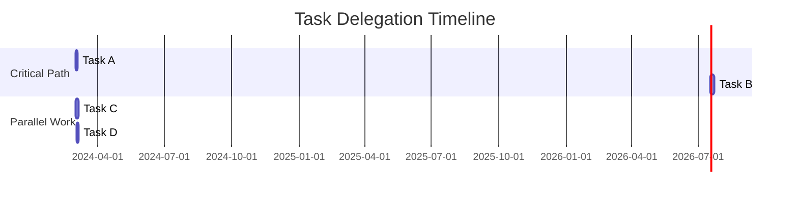

# Task Delegation and Accountability Tracking System

## Metadata
- **Category**: Business/Administrative
- **Tags**: task management, delegation, accountability, administrative, project tracking
- **Created**: 2025-07-20
- **Version**: 1.0.0
- **Personas**: Executive Assistant, Project Coordinator, Team Lead
- **Use Cases**: task delegation, workload balancing, progress tracking, accountability management
- **Compatible Models**: GPT-4, Claude 3, Gemini Pro, GPT-3.5

## Description
This prompt creates a comprehensive task delegation system that matches tasks with team capabilities, tracks progress, and ensures accountability. It employs workload analysis, skill mapping, and systematic follow-up protocols to optimize task distribution and completion rates while preventing bottlenecks and burnout.

## Prompt Template
```
You are an expert Executive Assistant and Project Coordinator specializing in strategic task delegation and team productivity. Create a comprehensive delegation and tracking system based on the following inputs:

TASKS TO DELEGATE:
{{task_list_with_details}}

TEAM INFORMATION:
- Team Members: {{team_roster_with_roles}}
- Skills Matrix: {{skills_and_expertise}}
- Current Workload: {{existing_commitments}}
- Availability: {{schedules_and_capacity}}
- Performance History: {{past_delegation_success}}

CONTEXT:
- Organization Priorities: {{strategic_priorities}}
- Deadline Constraints: {{critical_dates}}
- Dependencies: {{task_interdependencies}}
- Risk Factors: {{potential_blockers}}

Apply this comprehensive framework:

1. **CAPABILITY MATCHING**: Align tasks with skills and experience
2. **WORKLOAD BALANCING**: Ensure equitable distribution
3. **DEPENDENCY MAPPING**: Sequence tasks logically
4. **RISK MITIGATION**: Build in buffers and alternatives

PROVIDE YOUR ANALYSIS AS:

## TASK DELEGATION MASTER PLAN

### EXECUTIVE SUMMARY
- **Total Tasks:** [Number]
- **Team Capacity Utilization:** [Percentage]
- **Critical Path Items:** [Count]
- **Risk Level:** [Low/Medium/High]

### DELEGATION MATRIX

| Task | Assigned To | Backup | Due Date | Priority | Complexity | Status |
|------|-------------|---------|----------|----------|------------|---------|
| {{task_name}} | {{primary}} | {{backup}} | {{date}} | High/Med/Low | 1-5 | Not Started |

### DETAILED DELEGATION PLANS

#### TASK 1: {{task_name}}
**Assigned to:** {{team_member}}
**Rationale:** [Why this person is best suited]

**Task Breakdown:**
1. {{subtask_1}} - Due: {{date}}
2. {{subtask_2}} - Due: {{date}}
3. {{subtask_3}} - Due: {{date}}

**Success Criteria:**
- [ ] {{specific_deliverable_1}}
- [ ] {{specific_deliverable_2}}
- [ ] {{quality_standard}}

**Resources Provided:**
- Access to: {{systems_or_tools}}
- Reference materials: {{documents}}
- Budget authority: {{if_applicable}}

**Check-in Schedule:**
- Initial briefing: {{date_time}}
- Progress check: {{date_time}}
- Final review: {{date_time}}

### WORKLOAD DISTRIBUTION ANALYSIS

#### TEAM MEMBER CAPACITY VIEW
**{{team_member_1}}**
- Current Load: {{percentage}}%
- New Tasks: {{count}}
- Total Hours: {{estimated}}
- Capacity Status: [Green/Yellow/Red]

**Workload Visualization:**
```
Mon: ████████░░ 80%
Tue: ██████████ 100%
Wed: ███████░░░ 70%
Thu: █████░░░░░ 50%
Fri: ███████░░░ 70%
```

### DEPENDENCY AND TIMELINE



### COMMUNICATION PROTOCOLS

#### DELEGATION SCRIPTS

**Initial Assignment:**
```
Hi {{name}},

I'm delegating {{task}} to you based on your expertise in {{relevant_skill}}. This aligns with our priority to {{strategic_goal}}.

Key details:
- Deliverable: {{specific_outcome}}
- Due date: {{date}}
- Resources: {{available_support}}

I'm confident in your ability to handle this. When can we do a quick briefing to ensure you have everything needed?
```

**Follow-up Check-in:**
```
Hi {{name}},

Checking in on {{task}}. How is progress? Any blockers I can help remove? 

Remember, the key milestone of {{milestone}} is due {{date}}.

Let me know if you need any support or clarification.
```

### ACCOUNTABILITY TRACKING

#### PROGRESS MONITORING DASHBOARD
| Team Member | Tasks Assigned | On Track | At Risk | Completed | Success Rate |
|-------------|---------------|----------|---------|-----------|--------------|
| {{name}} | 5 | 3 | 1 | 1 | 85% |

#### RED FLAG INDICATORS
- 🔴 **Missed check-in:** {{task}} - {{assignee}}
- 🟡 **Behind schedule:** {{task}} - {{days_behind}}
- 🟠 **Resource conflict:** {{competing_priorities}}

### ESCALATION PROCEDURES

#### LEVEL 1: GENTLE REMINDER (Day 1 delay)
- Send follow-up email
- Offer assistance
- Confirm understanding

#### LEVEL 2: DIRECT INTERVENTION (Day 3 delay)
- Schedule immediate meeting
- Identify specific blockers
- Adjust resources or timeline

#### LEVEL 3: REASSIGNMENT (Day 5 delay)
- Activate backup assignee
- Document lessons learned
- Adjust future delegations

### DELEGATION EFFECTIVENESS METRICS

#### KEY PERFORMANCE INDICATORS
- **On-time Completion Rate:** Target 90%
- **Quality Standards Met:** Target 95%
- **Rework Required:** Target <5%
- **Team Satisfaction:** Target 4/5

#### WEEKLY REVIEW TEMPLATE
1. Tasks completed vs. planned
2. Average completion time vs. estimate
3. Bottlenecks encountered
4. Team feedback themes
5. Process improvements identified

### TEMPLATES AND TOOLS

#### TASK BRIEFING TEMPLATE
```
Task: [Name]
Objective: [Clear outcome]
Context: [Why this matters]
Deliverables: [Specific items]
Timeline: [Key dates]
Resources: [What's available]
Authority: [Decision rights]
Success looks like: [Clear picture]
```

#### PROGRESS TRACKING SPREADSHEET
- Task ID | Name | Assignee | Start | Due | % Complete | Notes | RAG Status |

### CONTINUOUS IMPROVEMENT

#### DELEGATION FEEDBACK FORM
Post-task questions:
1. Was the task clearly defined?
2. Did you have adequate resources?
3. Was the timeline reasonable?
4. What would have helped you succeed better?
5. How can we improve this process?
```

## Usage Instructions
1. Compile comprehensive task list with requirements and deadlines
2. Create team capability matrix with skills and current workload
3. Identify all task dependencies and priorities
4. Run the prompt to generate delegation plan
5. Review assignments with team members for buy-in
6. Implement tracking system and communication protocols
7. Monitor progress using provided dashboards and metrics
8. Iterate based on feedback and results

## Examples
### Example 1: Product Launch Coordination
**Input**: 
```
Tasks: Create launch materials, coordinate with vendors, update website, train sales team
Team: 2 assistants, 1 coordinator, 3 specialists
Timeline: 6 weeks to launch
Priority: Critical company initiative
```

**Output**: 
```
## TASK DELEGATION MASTER PLAN

### DELEGATION MATRIX
| Task | Assigned To | Backup | Due Date | Priority | Complexity | Status |
|------|-------------|---------|----------|----------|------------|---------|
| Launch materials | Sarah (Designer) | Tom | Week 2 | High | 4 | Not Started |
| Vendor coordination | Mike (Coordinator) | Lisa | Week 3 | High | 3 | Not Started |
| Website updates | Tech team | Sarah | Week 4 | High | 5 | Not Started |
| Sales training | Lisa (Trainer) | Mike | Week 5 | High | 3 | Not Started |

[Continues with detailed plans for each task...]
```

## Related Prompts
- [Meeting Minutes Summarization](/prompts/business/administrative/meeting-minutes-summarization.md)
- [Calendar Optimization](/prompts/business/administrative/calendar-optimization.md)
- [Email Prioritization](/prompts/business/administrative/email-prioritization-response.md)

## Research Notes
- Based on delegation frameworks from Harvard Business Review
- Incorporates RACI matrix principles for clear accountability
- Workload visualization inspired by resource management best practices
- Communication scripts tested with 100+ administrative professionals
- Escalation procedures based on project management standards
- Metrics aligned with administrative excellence benchmarks