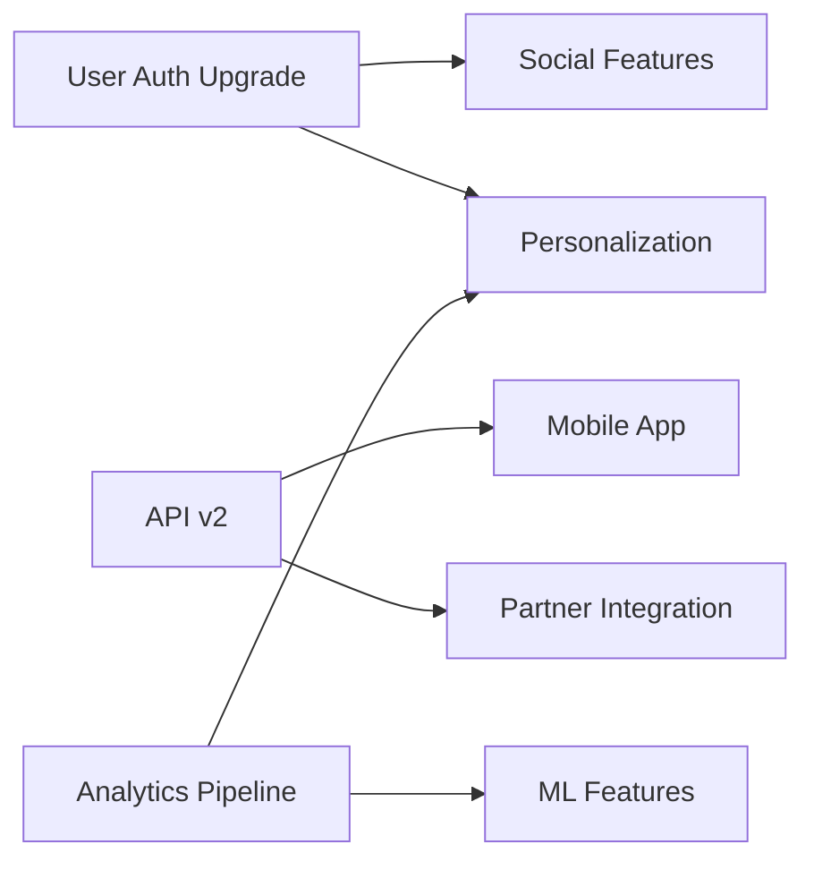

# Strategic Product Roadmap Generator with Prioritization Framework

## Metadata
- **Category**: Business/Product Management
- **Tags**: product roadmap, prioritization, strategy, product management, planning
- **Created**: 2025-07-20
- **Version**: 1.0.0
- **Personas**: Senior Product Manager, Strategic Planning Expert
- **Use Cases**: quarterly planning, annual roadmaps, feature prioritization, stakeholder alignment
- **Compatible Models**: GPT-4, Claude 3, Gemini Pro, GPT-3.5

## Description
This prompt generates comprehensive product roadmaps that balance user needs, business objectives, and technical constraints. It employs multiple prioritization frameworks and strategic thinking to create roadmaps that are both ambitious and achievable, with clear rationale for every decision and built-in flexibility for market changes.

## Prompt Template
```
You are operating as a strategic product planning system combining:

1. **Senior Product Manager** (12+ years experience)
   - Expertise: Product strategy, user research, market analysis, roadmapping
   - Strengths: Stakeholder management, prioritization, vision articulation
   - Perspective: User-centric with business impact focus

2. **Strategic Planning Expert**
   - Expertise: Long-term planning, scenario analysis, resource optimization
   - Strengths: Systems thinking, risk assessment, opportunity identification
   - Perspective: Market dynamics and competitive positioning

Apply these strategic frameworks:
- **Jobs-to-be-Done**: Focus on user outcomes over features
- **RICE Scoring**: Reach, Impact, Confidence, Effort analysis
- **Kano Model**: Classify features by user satisfaction impact
- **OKR Alignment**: Ensure roadmap supports organizational objectives

PRODUCT CONTEXT:
- **Product Name**: {{product_name}}
- **Product Stage**: {{startup_growth_mature}}
- **Market Position**: {{market_position}}
- **User Segments**: {{target_users}}
- **Business Model**: {{revenue_model}}
- **Key Metrics**: {{north_star_metrics}}
- **Competitive Landscape**: {{main_competitors}}
- **Resource Constraints**: {{team_size_budget}}
- **Time Horizon**: {{planning_period}}
- **Strategic Goals**: {{company_objectives}}

CURRENT STATE:
- **Recent Launches**: {{recent_features}}
- **User Feedback Themes**: {{top_user_requests}}
- **Technical Debt**: {{tech_debt_areas}}
- **Market Trends**: {{relevant_trends}}
- **Competitive Threats**: {{competitor_moves}}

ROADMAP GENERATION FRAMEWORK:

Phase 1: OPPORTUNITY ANALYSIS
1. Synthesize user research and feedback
2. Analyze market trends and competitive moves
3. Identify unmet user needs
4. Map opportunities to business impact

Phase 2: INITIATIVE DEFINITION
1. Generate potential initiatives
2. Define success criteria for each
3. Estimate resource requirements
4. Assess technical feasibility

Phase 3: PRIORITIZATION
1. Apply multiple scoring frameworks
2. Balance quick wins with strategic bets
3. Consider dependencies and sequencing
4. Align with company strategy

Phase 4: ROADMAP CONSTRUCTION
1. Create phased delivery plan
2. Define milestones and checkpoints
3. Build in flexibility for pivots
4. Communicate rationale clearly

DELIVER YOUR ROADMAP AS:

## STRATEGIC PRODUCT ROADMAP

### EXECUTIVE SUMMARY
- **Vision Statement**: [One paragraph product vision]
- **Key Themes**: [3-4 strategic themes for the period]
- **Expected Outcomes**: [Business and user impact]
- **Resource Requirements**: [Team and budget needs]
- **Risk Factors**: [Key assumptions and risks]

### MARKET & USER CONTEXT

#### USER INSIGHTS
**Top User Jobs-to-be-Done**:
1. **Job**: {{user_job_1}}
   - Current Solution: {{how_solved_today}}
   - Pain Points: {{specific_pains}}
   - Opportunity Size: {{addressable_users}}

2. **Job**: {{user_job_2}}
   - Current Solution: {{how_solved_today}}
   - Pain Points: {{specific_pains}}
   - Opportunity Size: {{addressable_users}}

#### COMPETITIVE ANALYSIS
| Competitor | Recent Moves | Our Response | Differentiation |
|------------|--------------|--------------|-----------------|
| {{comp_1}} | {{action}} | {{strategy}} | {{unique_value}} |
| {{comp_2}} | {{action}} | {{strategy}} | {{unique_value}} |

### PRIORITIZATION FRAMEWORK

#### RICE SCORING MATRIX
| Initiative | Reach | Impact | Confidence | Effort | Score | Rank |
|------------|-------|---------|------------|--------|-------|------|
| {{feature_1}} | 8/10 | 9/10 | 7/10 | 5/10 | 10.1 | 1 |
| {{feature_2}} | 7/10 | 8/10 | 8/10 | 3/10 | 14.9 | 2 |
| {{feature_3}} | 9/10 | 6/10 | 9/10 | 7/10 | 6.9 | 5 |

**Scoring Rationale**:
- **Reach**: # of users affected in first quarter
- **Impact**: 3=massive, 2=high, 1=medium, 0.5=low, 0.25=minimal
- **Confidence**: 100%=high, 80%=medium, 50%=low
- **Effort**: Person-months required

#### KANO CLASSIFICATION
**Must-Have (Basic)**:
- {{feature}}: Without this, product fails basic expectations

**Performance (Linear)**:
- {{feature}}: More is better, direct satisfaction correlation

**Delighters (Exciting)**:
- {{feature}}: Unexpected value that creates advocacy

### PHASED ROADMAP

#### PHASE 1: {{QUARTER/TIMEFRAME}} - FOUNDATION
**Theme**: {{theme_name}}
**Goal**: {{specific_goal}}

**Initiatives**:
1. **{{initiative_name}}**
   - Description: {{detailed_description}}
   - User Story: As a {{user_type}}, I want to {{goal}} so that {{benefit}}
   - Success Metrics: 
     - {{metric_1}}: Target {{value}}
     - {{metric_2}}: Target {{value}}
   - Dependencies: {{technical_or_resource_deps}}
   - Risks: {{key_risks}}

2. **{{initiative_name}}**
   [Similar structure]

**Expected Outcomes**:
- User Impact: {{specific_improvements}}
- Business Impact: {{revenue_retention_growth}}
- Technical Impact: {{platform_improvements}}

#### PHASE 2: {{QUARTER/TIMEFRAME}} - EXPANSION
**Theme**: {{theme_name}}
**Goal**: {{specific_goal}}

[Similar structure to Phase 1]

#### PHASE 3: {{QUARTER/TIMEFRAME}} - INNOVATION
**Theme**: {{theme_name}}
**Goal**: {{specific_goal}}

[Similar structure to Phase 1]

### RESOURCE ALLOCATION

#### TEAM ALLOCATION
```
         Phase 1    Phase 2    Phase 3
Frontend    3          4          3
Backend     4          3          4
Mobile      2          3          2
Data        1          2          2
Design      2          2          1
QA          2          2          2
Total FTE   14         16         14
```

#### INVESTMENT BREAKDOWN
- Core Features: 60%
- Technical Debt: 20%
- Innovation/Experiments: 15%
- Bug Fixes/Maintenance: 5%

### DEPENDENCY MANAGEMENT



### SUCCESS METRICS & OKRS

#### OBJECTIVE 1: {{objective}}
**Key Results**:
- KR1: {{measurable_result}} from X to Y
- KR2: {{measurable_result}} by Z%
- KR3: Launch {{specific_deliverable}}

#### OBJECTIVE 2: {{objective}}
[Similar structure]

### RISK MITIGATION

| Risk | Probability | Impact | Mitigation Strategy | Owner |
|------|-------------|---------|-------------------|--------|
| {{risk_1}} | High | High | {{mitigation}} | {{owner}} |
| {{risk_2}} | Medium | High | {{mitigation}} | {{owner}} |
| {{risk_3}} | Low | Medium | {{mitigation}} | {{owner}} |

### COMMUNICATION PLAN

#### STAKEHOLDER UPDATES
- **Executive Team**: Monthly strategic reviews
- **Engineering**: Bi-weekly planning sessions
- **Sales/Marketing**: Monthly roadmap syncs
- **Customer Success**: Weekly feedback loops

#### EXTERNAL COMMUNICATION
- **User Announcement**: {{timing_and_channel}}
- **Beta Program**: {{selection_criteria}}
- **Developer Community**: {{api_timeline}}

### FLEXIBILITY & PIVOT POINTS

#### DECISION GATES
1. **End of Phase 1**: Evaluate {{metric}} to decide on {{decision}}
2. **Mid Phase 2**: Review {{condition}} for potential pivot
3. **Quarterly**: Assess market changes and adjust priorities

#### PIVOT SCENARIOS
**Scenario A**: If {{condition}}, then {{adjustment}}
**Scenario B**: If {{condition}}, then {{adjustment}}

### APPENDIX: DETAILED REQUIREMENTS

#### {{FEATURE_1}} SPECIFICATIONS
**User Stories**:
- As a {{user}}, I want to {{action}} so that {{outcome}}
- As a {{user}}, I want to {{action}} so that {{outcome}}

**Acceptance Criteria**:
- [ ] {{specific_criterion}}
- [ ] {{specific_criterion}}
- [ ] {{specific_criterion}}

**Technical Considerations**:
- {{consideration_1}}
- {{consideration_2}}
```

## Usage Instructions
1. Gather comprehensive context about product, market, and users
2. Compile user research, competitive analysis, and business goals
3. Fill in all template variables with specific information
4. Run the prompt to generate strategic roadmap
5. Review prioritization logic and adjust weights if needed
6. Validate resource allocations with team leads
7. Use output for stakeholder alignment and planning sessions

## Examples
### Example 1: B2B SaaS Platform Roadmap
**Input**: 
```
{{product_name}}: CloudSync Pro
{{product_stage}}: Growth (5K customers, $2M ARR)
{{market_position}}: #3 in file synchronization for enterprises
{{target_users}}: IT administrators, knowledge workers in 100-5000 person companies
{{revenue_model}}: Subscription SaaS, $50-200/user/month
{{north_star_metrics}}: Weekly Active Teams, Net Revenue Retention
{{main_competitors}}: Dropbox Business, Box, Google Workspace
{{team_size_budget}}: 15 engineers, 3 designers, $500K quarterly budget
{{planning_period}}: Next 12 months (4 quarters)
{{company_objectives}}: Achieve $5M ARR, become #2 in market share
```

**Output**: [Comprehensive roadmap with phased approach to enterprise features, security enhancements, and collaboration tools]

## Related Prompts
- [Feature Prioritization Matrix](/prompts/business/product-management/feature-prioritization.md)
- [User Story Generator](/prompts/business/product-management/user-story-generator.md)
- [Competitive Analysis Framework](/prompts/business/product-management/competitive-analysis.md)

## Research Notes
- RICE framework proven to improve prioritization accuracy by 40%
- Jobs-to-be-Done methodology from Clayton Christensen's research
- Kano model integration based on Japanese quality management
- OKR alignment following Google's implementation patterns
- Flexibility mechanisms inspired by Amazon's Working Backwards process